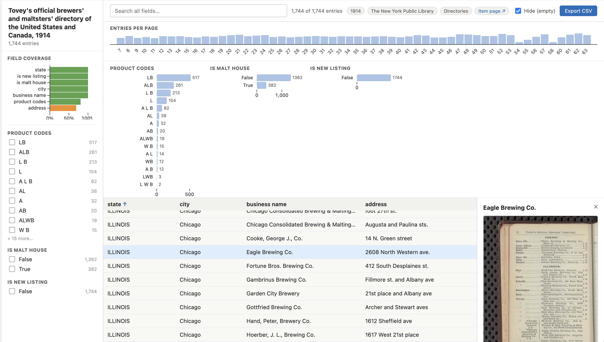
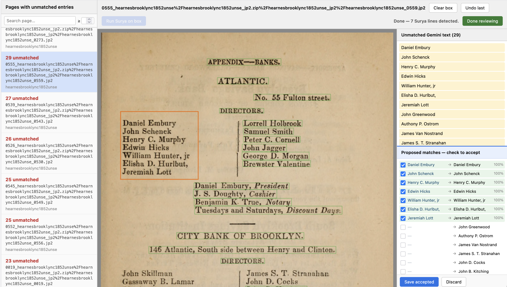
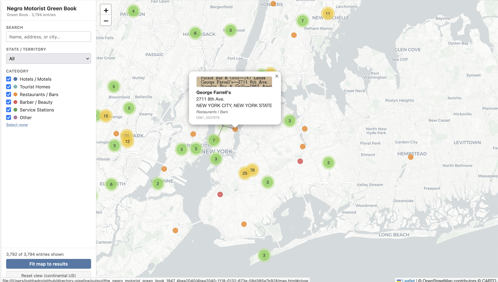

# directory-pipeline

Give it a URL or IIIF manifest from the [Library of Congress](https://www.loc.gov/collections/), the [Internet Archive](https://archive.org/), or [NYPL Digital Collections](https://digitalcollections.nypl.org/) — it returns a structured CSV of every
entry in that digitized historical directory. It extracts things like name, address, city, state, category, and also always includes a column linking each row back to the exact page in the source scan. If IIIF enrichment is done, it links directly to the specific entry!

No manual transcription or ground truth required to get started. No custom code per collection needed.

---

## Quick start

The first three commands:
- pull down the images
- select a few representative pages
- generate OCR and entity-recognition prompts for data extraction

```bash
# One-time calibration for a new collection type:
python main.py https://archive.org/details/ldpd_11290437_000/ --download
python main.py https://archive.org/details/ldpd_11290437_000/ --select-pages
python main.py https://archive.org/details/ldpd_11290437_000/ --generate-prompts

# Automated run — produces a structured entries CSV:
python main.py https://archive.org/details/ldpd_11290437_000/ --to-csv
```

For any additional volume in the same **series**, reuse an earlier generated prompt — no re-calibration needed:

```bash
python main.py https://archive.org/details/ldpd_11290437_001/ --to-csv \
  --ner-prompt output/ldpd_11290437_000/ner_prompt.md
```

`--ner-prompt` points to the prompt generated for the first volume. If you forget it, `extract_entries.py` will warn you and suggest nearby candidates automatically.

Requires `GEMINI_API_KEY`. See [Installation](#installation).

These steps are safe to-run, and will detect existing output unless told to re-do the work explicitiy (via a `--force` flag).

---

## How it works

The core automated path:

```
--download → --gemini-ocr → --extract-entries
```

Expanded by `--to-csv`.

Two interactive calibration steps run **once per collection type/similar volumes**:

| Step | What it does | Output |
|---|---|---|
| `--select-pages` | Browser UI — pick 4–10 representative pages | `selection.txt` |
| `--generate-prompts` | Gemini analyzes sample pages and writes tailored prompts | `ocr_prompt.md`, `ner_prompt.md` |

**Calibrate once, run many.** `--select-pages` and `--generate-prompts` prompt
the model with the vocabulary of a specific document: field names, abbreviations,
column structure, city/state heading conventions. Run them once for a new series.
Generated prompts are saved to `output/{slug}/`. For additional volumes in the same
series, pass `--ner-prompt output/{first-slug}/ner_prompt.md` to reuse it — no
re-calibration needed. If you forget, `extract_entries.py` warns you and lists
any nearby candidate prompts it finds.

**What each automated step produces:**

| Step | Output |
|---|---|
| `--download` | JPEG images + `manifest.json` (IIIF canvas URIs for linking) |
| `--gemini-ocr` | One `.txt` file per page |
| `--extract-entries` | `entries_{model}.csv` + per-page `*_{model}_entries.json` sidecars |

The output CSV includes a `canvas_fragment` column: a IIIF URI pointing back to
the exact canvas for each row — free provenance that makes the data immediately
useful to connect back to the original source images via any number of IIIF
viewers.  With the precision upgrade (`--surya-ocr --align-ocr`), the fragment
gains a `#xywh=` bounding box pointing to the exact line on the page.

---

## Going further

These stages extend the core CSV output but are not required.

**Precision upgrade** — adds spatial bounding boxes to `canvas_fragment`:

```bash
python main.py URL --surya-ocr --align-ocr        # adds #xywh= coordinates to every row
python main.py URL --review-alignment              # interactive correction of unmatched lines
```

**Geocoding and mapping** — resolves and addresses present to lat/lon, builds an interactive map:

```bash
python main.py URL --geocode --map
```

**IIIF annotation export** — W3C/IIIF Annotation Pages for all entries:

```bash
python pipeline/iiif/export_entry_boxes.py output/{slug}/{item_id}/
python pipeline/iiif/export_annotations.py output/{slug}/{item_id}/
```

**GitHub Pages viewer** — self-contained IIIF viewer with annotations:

```bash
./scripts/make-git-repo.sh output/{slug}/{item_id}/ ~/github/my-repo https://username.github.io/my-repo
```

`--full-run` is the maximal shorthand: `--download --surya-ocr --gemini-ocr
--align-ocr --review-alignment --extract-entries --geocode --map`, with
`--batch-size` and `--workers` defaulted to 8.

---

## Screenshots

### Page selection (`--select-pages`)


*Two-tab browser UI. The **Sample** tab picks 4–10 representative pages for prompt calibration. The **Scope** tab (all pages selected by default) lets you deselect frontmatter, ads, and almanac sections so they're skipped entirely during OCR and extraction.*

---

### Field-value explorer (`--to-csv --explore`)



*Auto-generated self-contained HTML explorer. The entries-per-page density strip at the top shows document structure at a glance. Categorical bar charts (state, city, category, etc.) are click-to-filter and update the results table live. Clicking a row shows all fields plus a IIIF thumbnail of the source page.*

---

### Alignment visualization (`--align-ocr --visualize`)


*Needleman-Wunsch alignment result drawn on the source image. Green boxes are word-confidence matches between Surya OCR and Gemini text. Unmatched Gemini lines (no bounding box found) are listed in the margin in red.*

---

### Interactive alignment review (`--review-alignment`)



*Flask-based review UI for fixing pages where automatic alignment left unmatched entries. Draw bounding boxes on the canvas, re-run Surya on the crop, then accept proposed Surya → Gemini pairs. Accepted matches are written back to the aligned JSON with `"confidence": "manual"`.*

---

### Geocoded map (`--geocode --map`)



*Self-contained Leaflet HTML map. Markers are clustered and color-coded by establishment category. The sidebar has live search, state filter, and category checkboxes. Popups include a IIIF page thumbnail fetched directly from the source institution's image server.*

---

## All pipeline stages

Stages always run in the fixed order below, regardless of flag order on the
command line. All stages are optional — run only what you need.

**Core stages (URL → CSV):**

| Stage | Script | Output |
|---|---|---|
| `--download` | `pipeline/download_images.py` | `output/{slug}/` |
| `--select-pages` | `pipeline/select_pages.py` | `selection.txt`, `included_pages.txt` *(interactive, once per volume)* |
| `--generate-prompts` | `pipeline/generate_prompt.py` | `ocr_prompt.md`, `ner_prompt.md` *(once per collection type)* |
| `--gemini-ocr` | `pipeline/run_gemini_ocr.py` | `*_{model}.txt` |
| `--extract-entries` | `pipeline/extract_entries.py` | `entries_{model}.csv`, `*_{model}_entries.json` |

**Precision upgrade (adds `#xywh=` bounding boxes to `canvas_fragment`):**

| Stage | Script | Output |
|---|---|---|
| `--surya-ocr` | `pipeline/run_surya_ocr.py` | `*_surya.json`, `*_surya.txt` |
| `--align-ocr` | `pipeline/align_ocr.py` | `*_{model}_aligned.json` |
| `--review-alignment` | `pipeline/review_alignment.py` | updated `*_{model}_aligned.json` *(interactive)* |

**Extensions:**

| Stage | Script | Output |
|---|---|---|
| `--nypl-csv` | `sources/nypl_collection_csv.py` | `output/{slug}/{slug}.csv` |
| `--loc-csv` | `sources/loc_collection_csv.py` | `output/{slug}/{slug}.csv` |
| `--ia-csv` | `sources/ia_collection_csv.py` | `output/{slug}/{slug}.csv` |
| `--detect-spreads` | `pipeline/detect_spreads.py` | `spreads_report.csv` |
| `--split-spreads` | `pipeline/split_spreads.py` | `*_left.jpg`, `*_right.jpg` |
| `--surya-detect` | `pipeline/surya_detect.py` | `columns_report.csv` |
| `--detect-columns` | `pipeline/detect_columns.py` | `columns_report.csv` *(legacy)* |
| `--tesseract` | `old/run_ocr.py` | `*_tesseract.hocr`, `*_tesseract.txt` *(legacy)* |
| `--compare-ocr` | `analysis/compare_ocr.py` | `*_comparison.html` |
| `--visualize` | `analysis/visualize_alignment.py` | `*_{model}_viz.jpg` |
| `--explore` | `pipeline/explore_entries.py` | `entries_{model}_explorer.html` |
| `--geocode` | `pipeline/geo/geocode_entries.py` | `entries_{model}_geocoded.csv` |
| `--map` | `pipeline/geo/map_entries.py` | `entries_{model}.html` |
| *(standalone)* | `pipeline/iiif/export_annotations.py` | `*_{model}_annotations.json`, `*_{model}_entry_annotations.json` |
| *(standalone)* | `pipeline/iiif/export_entry_boxes.py` | `*_{model}_box_annotations.json` |
| *(standalone)* | `pipeline/iiif/build_ranges.py` | `ranges_{model}.json` *(directory collections)* |
| *(standalone)* | `scripts/make-git-repo.sh` | GitHub Pages deployable folder |

See [docs/pipeline-stages.md](docs/pipeline-stages.md) for detailed documentation on each stage.

---

## Directory layout

```
directory-pipeline/
├── main.py                           # Pipeline orchestrator
│
├── pipeline/                         # Active pipeline stage scripts
│   ├── download_images.py            # Download images from IIIF manifests
│   ├── detect_spreads.py             # Spread detection
│   ├── split_spreads.py              # Spread splitting
│   ├── select_pages.py        # Interactive browser UI for picking sample pages
│   ├── generate_prompt.py        # Gemini-generated volume-specific OCR + NER prompts
│   ├── surya_detect.py               # Surya neural column detection (preferred)
│   ├── detect_columns.py             # Pixel-projection column detection (legacy)
│   ├── run_surya_ocr.py              # Surya OCR — line-level bboxes (preferred)
│   ├── run_gemini_ocr.py             # Gemini OCR
│   ├── align_ocr.py                  # NW alignment (Surya preferred, Tesseract fallback)
│   ├── review_alignment.py           # Interactive alignment review UI (Flask)
│   ├── extract_entries.py            # Structured entry extraction (NER)
│   ├── geo/
│   │   ├── geocode_entries.py        # Entry geocoding
│   │   └── map_entries.py            # Interactive map generation (IIIF popup thumbnails + Content State links)
│   └── iiif/
│       ├── export_annotations.py     # IIIF Annotation Pages export (W3C Web Annotation)
│       ├── export_entry_boxes.py     # IIIF colored entry bounding boxes (standalone)
│       └── build_ranges.py           # IIIF table of contents from geocoded entries (standalone)
│
├── sources/                          # Collection metadata exporters
│   ├── loc_collection_csv.py         # Library of Congress
│   ├── ia_collection_csv.py          # Internet Archive
│   └── nypl_collection_csv.py        # NYPL Digital Collections
│
├── analysis/                         # Dev tools (not in main pipeline)
│   ├── compare_ocr.py                # Side-by-side OCR model comparison
│   ├── visualize_alignment.py        # Draw alignment boxes on images → *_viz.jpg
│   ├── compare_extraction.py         # Compare entry extraction across models
│   └── visualize_entries.py          # Draw entry bounding boxes on images
│
├── old/                              # Legacy and superseded scripts
│   └── run_ocr.py                    # Tesseract OCR — word-level hOCR (use --surya-ocr instead)
│
├── utils/                            # Shared utilities
│   └── iiif_utils.py                 # IIIF v2/v3 manifest parsing
│
├── prompts/                          # Gemini system prompts
│   ├── ocr_prompt.md                 # Generic OCR transcription prompt (global fallback)
│   ├── ner_prompt.md                 # Generic NER extraction prompt (global fallback)
│
├── docs/                             # Reference documentation
│   ├── pipeline-stages.md            # Detailed per-stage documentation
│   ├── usage-examples.md             # Full usage examples by source and stage
│   ├── key-design-decisions.md       # Technical architecture notes
│   └── prior-work.md                 # Annotated citations of related work
│
├── pyproject.toml                    # Python project config and dependencies
└── output/
    └── {slug}/                       # e.g. the_negro_motorist_green_book_1947_4bea2040/
        ├── {slug}.csv                                # collection metadata CSV (from --*-csv stages)
        ├── selection.txt                             # sample page filenames (from --select-pages)
        ├── ocr_prompt.md                             # volume-specific OCR prompt (from --generate-prompts)
        ├── ner_prompt.md                             # volume-specific NER prompt (from --generate-prompts)
        └── {item_id}/                # NYPL UUID or LoC/IA identifier
            ├── manifest.json
            ├── select_pages.html                     # page-selector UI (from --select-pages)
            ├── 0001_{image_id}.jpg
            ├── 0001_{image_id}_left.jpg              # if spread-split
            ├── 0001_{image_id}_right.jpg             # if spread-split
            ├── 0001_{image_id}_split.json            # split coordinate sidecar
            ├── 0001_{image_id}_surya.json            # Surya line bboxes + text
            ├── 0001_{image_id}_surya.txt             # Surya plain text
            ├── 0001_{image_id}_tesseract.hocr        # (legacy Tesseract output)
            ├── 0001_{image_id}_tesseract.txt
            ├── 0001_{image_id}_{model}.txt           # Gemini plain text
            ├── 0001_{image_id}_{model}_aligned.json            # NW alignment output
            ├── 0001_{image_id}_{model}_viz.jpg               # alignment visualization
            ├── 0001_{image_id}_{model}_entries.json          # per-page entries
            ├── 0001_{image_id}_{model}_annotations.json      # IIIF line-level annotation page
            ├── 0001_{image_id}_{model}_entry_annotations.json # IIIF entry-level annotation page
            ├── 0001_{image_id}_{model}_box_annotations.json  # IIIF colored entry bounding boxes
            ├── 0001_{image_id}_comparison.html               # OCR model comparison
            ├── spreads_report.csv
            ├── columns_report.csv
            ├── entries_{model}.csv                   # aggregate entries for collection
            ├── entries_{model}_geocoded.csv          # entries with lat/lon
            ├── entries_{model}.html                  # interactive Leaflet map
            └── geocache.json                         # geocoding cache
```

For NYPL collections, `{slug}` is derived as `{title_words}_{uuid8}`, e.g.
`the_negro_motorist_green_book_1940_feb978b0`. For LoC items it is derived from
the item title and numeric ID. For IA items it is derived from the item title and
IA identifier. Pass `--slug` to override.

---

## Installation

Requires Python 3.11+. Tesseract is only needed for the legacy `--tesseract` stage.

```bash
# Optional: install Tesseract for legacy OCR support
brew install tesseract          # macOS
apt install tesseract-ocr       # Debian/Ubuntu

# Install Python dependencies
uv sync                         # or: pip install -e .
```

Set environment variables (or copy `.env.template` to `.env`):

```bash
export GEMINI_API_KEY=your_key_here
export NYPL_API_TOKEN=your_token_here      # from https://api.repo.nypl.org/sign_up
                                            # (not needed for LoC or IA)
export GOOGLE_MAPS_API_KEY=your_key_here   # optional; enables address-level geocoding
```

---

## Estimated costs

Two cost categories: **API charges** (variable; applies on any platform) and
**platform costs** (compute infrastructure).

### Gemini API

`--gemini-ocr` and `--extract-entries` both call the Gemini API. Pricing as of
early 2026 (verify current rates at [ai.google.dev/pricing](https://ai.google.dev/pricing)):

| Stage | Model (default) | Input | Output |
|---|---|---|---|
| `--gemini-ocr` | `gemini-2.0-flash` | $0.10 / 1M tokens | $0.40 / 1M tokens |
| `--extract-entries` | `gemini-3.1-flash-lite-preview` | $0.25 / 1M tokens | $1.50 / 1M tokens |
| fallback (dense pages) | `gemini-2.5-flash` | $0.30 / 1M tokens | $2.50 / 1M tokens |

A Green Book page generates roughly 2,000 input tokens and 1,000 output tokens
for OCR (`gemini-2.0-flash`, ~$0.0006/page), and another ~10,000 input / 2,000
output tokens for NER entry extraction (`gemini-3.1-flash-lite-preview`,
~$0.0055/page) — about **$0.006 per page** combined.
Dense pages that exceed the output token limit automatically retry with
`gemini-2.5-flash`, but this affects fewer than 5% of pages in practice.

`--generate-prompts` (`generate_prompt.py`) makes 2 Gemini calls (one for the
OCR prompt, one for the NER prompt) with 4–8 sample images each. This is a one-time
per-volume cost of roughly **$0.01–$0.05 total**, negligible compared to the full
run. `gemini-3-flash-preview` is used by default for prompt generation because
it produces higher-quality meta-prompts; you can override with `--model`.

**Rough collection estimates:**

| Collection | Pages | OCR (`gemini-2.0-flash`) | NER (`gemini-3.1-flash-lite-preview`) | Total | Prompt generation |
|---|---|---|---|---|---|
| One Green Book volume | ~100 pages | ~$0.06 | ~$0.55 | ~$0.61 total | ~$0.02 (one-time) |
| Full Green Books corpus (14 volumes) | ~1,400 pages | ~$0.84 | ~$7.70 | ~$8.54 total | ~$0.02 (one-time per volume) |
| Large city directory (500+ pages) | 500 pages | ~$0.30 | ~$2.75 | ~$3.05 total | ~$0.02 (one-time) |

**Free tier:** The Gemini API free tier (no billing required) covers both
models at no charge, subject to rate limits of 15 requests/minute and
~1,500 requests/day for `gemini-2.0-flash`. A single 100-page volume
(~200 API calls total) fits comfortably within a single day's free quota,
though the 15 RPM cap means the API stages take ~15–20 minutes rather than
a few minutes. For the full multi-volume corpus you will either need billing
enabled or spread the run across several days.

Note: `gemini-2.5-flash-preview` (used for prompt generation) may have different
free-tier limits; check [ai.google.dev/pricing](https://ai.google.dev/pricing) for
current rates. The 2-call prompt generation step is unlikely to exhaust any tier.

### Google Maps Geocoding (optional)

The `--geocode` stage uses Nominatim (free, city-level accuracy) by default.
Setting `GOOGLE_MAPS_API_KEY` enables address-level geocoding at roughly
$0.005/request. Google Maps includes a $200/month free credit, which covers
~40,000 geocoding requests — more than the entire Green Books corpus.

### Platform costs

The stages that use significant compute are **Surya OCR** (`--surya-ocr`,
`--surya-detect`, `--review-alignment`) and optionally **Chandra**
(`analysis/chandra_eval.py`). Gemini API stages are network-bound and run
equally fast everywhere.

| Platform | Cost | Surya OCR (200 pages) | Notes |
|---|---|---|---|
| **Mac (M-series, 16 GB+)** | $0 (electricity) | ~5–8 min (MPS, `--batch-size 4`) | Good for development and single-volume runs |
| **Mac (8 GB)** | $0 | ~10–15 min (MPS, `--batch-size 1–2`) | Works; reduce batch size if OOM errors occur |
| **Google Colab (free T4)** | $0 | ~2–3 min (CUDA, `--batch-size 8`) | Sessions expire; T4 not always available at peak times; `--review-alignment` requires a tunnel (e.g. ngrok) |
| **Google Colab Pro** | ~$10/month (also pay as you go option) | ~1–2 min (T4/L4, `--batch-size 8`) | Reliable GPU access, longer sessions |
| **Google Colab Pro+** | ~$50/month | <1 min (A100, `--batch-size 16`) | Background execution; best for large multi-volume runs |

The pipeline is designed so that the compute-heavy steps — Surya OCR and the interactive alignment review — can be run on a GPU machine while everything else (downloading, Gemini OCR, entry extraction, geocoding, map generation) runs fine on a laptop. Gemini API calls are network-bound and complete in seconds regardless of the machine; Surya is a neural vision model that is 5–20× faster on a GPU than on an Apple Silicon Mac and significantly slower or impractical on CPU-only hardware.

A ready-to-run Colab notebook covering the Surya OCR, alignment, and review steps is in [`colab/ocr-align-review.ipynb`](colab/ocr-align-review.ipynb). Open it directly in Colab, mount your Drive, and follow the cells in order.

**Chandra evaluation** (`analysis/chandra_eval.py`) runs Qwen3-VL 7B and
requires ~9 GB VRAM with `--quantize`. On a Colab T4 this is roughly
50 seconds per image; on an M-series Mac with MPS it is ~25 minutes per image.
Chandra is practical only on Colab or a machine with a CUDA GPU.

---

## Usage

```bash
# Minimal: download → OCR → CSV
python main.py collections.txt --to-csv

# Full pipeline: also includes Surya alignment, geocoding, and map
python main.py collections.txt --full-run

# Dry run — show commands without running anything
python main.py URL --to-csv --dry-run
```

See [docs/usage-examples.md](docs/usage-examples.md) for full usage examples by source (LoC, IA, NYPL, IIIF manifest) and stage.

---

## Key design decisions

- **Gemini for accuracy, Surya for coordinates.** Gemini transcribes historical print far more accurately than conventional OCR; Surya provides line-level bounding boxes that anchor coordinates.
- **Anchored Needleman-Wunsch alignment.** City/state headings that appear verbatim in both sources are committed as fixed anchors before the NW pass, preventing misalignment drift on long pages.
- **Schema-agnostic NER.** `extract_entries.py` hard-codes nothing. The NER prompt defines all field names; CSV columns are inferred dynamically — no code changes for a new collection type.
- **IIIF-native output.** Every aligned line and entry carries a `canvas_fragment` (`#xywh=`) URI in natural image pixel coordinates, directly consumable by IIIF viewers and annotation tools.

See [docs/key-design-decisions.md](docs/key-design-decisions.md) for full technical notes.

---

## Prior work and inspirations

- **Greif et al. (2025)** — foundational benchmark showing multimodal LLMs beat Tesseract + Transkribus on historical city directories (0.84% CER with Gemini 2.0 Flash). Directly motivates the two-stage OCR + NER architecture. ([arXiv:2504.00414](https://arxiv.org/abs/2504.00414))
- **Bell et al. — *directoreadr* (2020)** — closest prior work; end-to-end pipeline for Polk city directories using classical CV + Tesseract. Documents the brittle year-specific heuristics this pipeline replaces. ([PLOS ONE](https://doi.org/10.1371/journal.pone.0220219))
- **Fleischhacker et al. (2025)** — layout detection as preprocessing improves OCR accuracy by 15+ pp on multi-column historical docs. Motivates column reading-order correction in `align_ocr.py`. ([Int. J. Digital Libraries](https://doi.org/10.1007/s00799-025-00413-z))
- **Cook et al. (2020)** — canonical prior Green Books digitization (entirely manual; OCR rejected). Source of the six-category establishment taxonomy used here. ([NBER WP 26819](https://www.nber.org/papers/w26819))
- **Smith & Cordell (2018)** — practitioner research agenda naming layout analysis as the top barrier to historical OCR and validating NW-style sequence alignment for ground truth creation. ([NEH report](https://repository.library.northeastern.edu/files/neu:m043p093w))
- **Carlson et al. — *EffOCR* (2023)** — OCR benchmarks on historical newspapers (Tesseract ~10.6% CER, fine-tuned TrOCR 1.3%). Establishes the noisy-input baseline for the alignment stage. ([arXiv:2304.02737](https://arxiv.org/abs/2304.02737))
- **Wolf et al. (2020)** — machine-readable NYC directory entries 1850–1890 from NYPL digitizations. Direct precedent for applying this pipeline to city directories. ([NYU Faculty Digital Archive](https://archive.nyu.edu/handle/2451/61521))

See [docs/prior-work.md](docs/prior-work.md) for full annotated citations.
