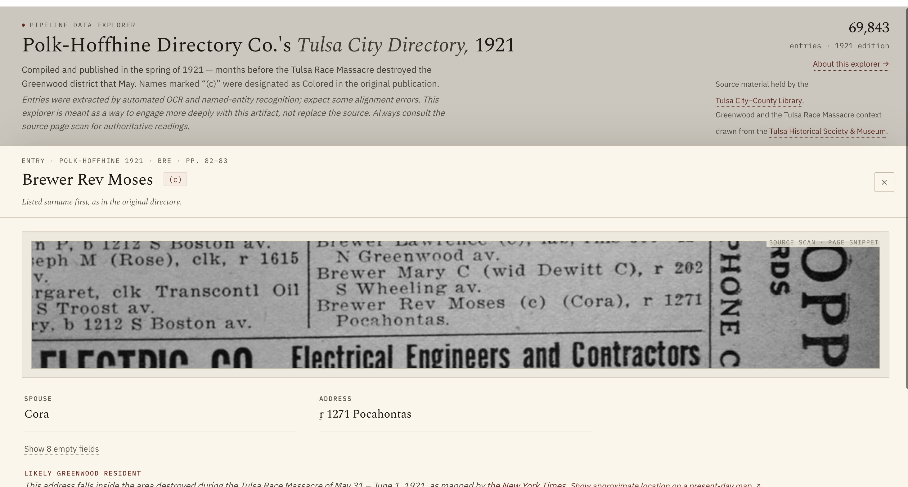
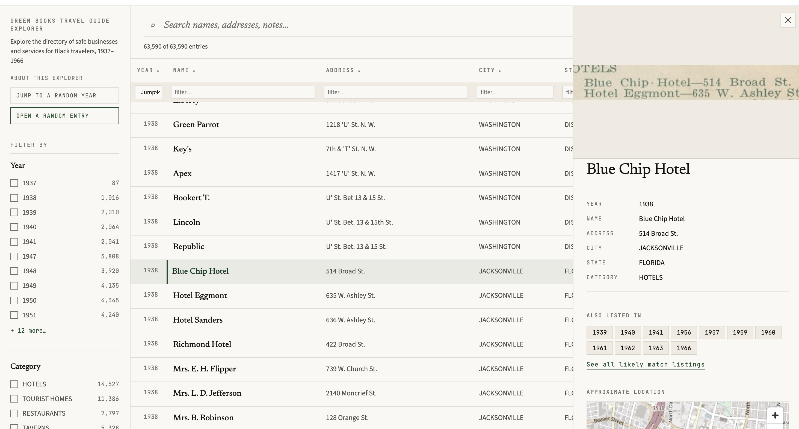

# directory-pipeline

Turn a public digital archive URL into a structured, browsable CSV — no manual transcription, no custom code per collection type.

Give it a URL from the [Library of Congress](https://www.loc.gov/collections/), [Internet Archive](https://archive.org/), or any institution that publishes a public IIIF manifest (CONTENTdm repositories included). It downloads the scans, OCRs them, and extracts entries into a structured CSV. With the enrichment steps, every row links back to the exact location in the original scan.

Built for digitized historical directories — city directories, gazetteers, trade directories — but works on just about any historical document with regular entry-like structure.


*The auto-generated data explorer. Categorical facets generated from the data, full-text search, IIIF page thumbnails, and a "View in source document" deep link for every row.*

---

## Quick start

Requires Python 3.11+ and [uv](https://docs.astral.sh/uv/).

```bash
uv sync        # installs dependencies and the `pipeline` command

# One-time calibration for a new collection type — generates OCR and NER
# prompts that will work for any item with the same entry structure
pipeline ingest    https://archive.org/details/ldpd_11290437_000/
pipeline calibrate https://archive.org/details/ldpd_11290437_000/

# Automated run — produces the entries CSV + browsable HTML explorer
pipeline run       https://archive.org/details/ldpd_11290437_000/
```

**Calibrate once, run many.** `pipeline calibrate` is a one-time step per collection type: it opens a browser UI where you pick 4–10 representative pages, then has Gemini analyze them and write tailored OCR and extraction prompts. For any additional volume in the same series, point to the first volume's NER prompt and skip calibration entirely:

```bash
pipeline run https://archive.org/details/ldpd_11290437_001/ \
  --ner-prompt output/ldpd_11290437_000/ner_prompt.md
```

Requires `GEMINI_API_KEY`. Can run on the [free tier](#costs) — no billing required for collections up to ~150 pages. Flex inference (~50% cheaper API calls, 1–15 min latency per request, best-effort availability) is on by default; pass `--no-flex` for time-sensitive runs.

---

## What you get

A CSV where every row is one extracted entry. Field names are driven entirely by your NER prompt — no code changes necessary for a new document or volume of the same type. An example entry from a travel guide:

| name | address | city | state | category | canvas_fragment |
|---|---|---|---|---|---|
| Mrs. Simmons Tourist Home | 418 Johnson St | Augusta | GA | Tourist Home | `https://...#xywh=142,890,1240,68` |

The `canvas_fragment` column is a IIIF URI pointing back to the source scan. With the [precision upgrade](#precision-upgrade), it includes a `#xywh=` bounding box pinpointing the exact line. The data explorer and map use this to link directly to the highlighted entry in the original document.

Alongside the extracted data CSV, `pipeline run` also generates a self-contained HTML data explorer (shown above). With geocoding enabled on materials with address fields, you also get:


*Markers clustered and color-coded by category. Popups include a IIIF thumbnail fetched directly from the source institution's image server.*

---

## Examples

Two published collections built with this pipeline:

- **[Tulsa city directories — 1921](https://hadro.github.io/tulsa-city-directories/1921#about)** — a Polk-style city directory.
- **[The Negro Motorist Green Book explorer](https://hadro.github.io/green-books/explorer#about)** — the full run of Green Book volumes.

<p>
  <a href="https://hadro.github.io/tulsa-city-directories/1921#about"></a>
  <a href="https://hadro.github.io/green-books/explorer#about"></a>
</p>

*Entry detail views from the published explorers. Left: each Tulsa entry renders the exact line from the source scan via its `canvas_fragment` URI. Right: a Green Book establishment with its listing history across volumes.*

> Both explorers received additional front-end design work beyond what the pipeline generates. The pipeline produces the entry CSVs, IIIF manifests, and a baseline HTML explorer; these published sites build on that output.

---

## Installation

Requires Python 3.11+ and [uv](https://docs.astral.sh/uv/).

```bash
uv sync                  # core: Gemini OCR + entry extraction
uv sync --extra gpu      # add Surya OCR (GPU or Apple Silicon recommended)
uv sync --extra geo      # add geocoding + map generation
uv sync --all-extras     # everything
```

This installs the `pipeline` command (run `pipeline --help` for all subcommands):

```bash
pipeline run    <URL>          # automated: download → OCR → extract → explore
pipeline guided <URL>          # human-in-loop: page selection + alignment review
pipeline ingest <URL>          # download only
pipeline calibrate <URL|DIR>   # select sample pages + generate prompts (once per collection type)
pipeline ocr    <DIR>          # Surya OCR + Gemini OCR + align bboxes
pipeline extract <DIR>         # NER extraction + explorer
pipeline review  <DIR>         # interactive alignment review (browser UI)
pipeline postprocess <DIR>     # fix + combine volumes + rebuild explorer
```

Each subcommand wraps the underlying `python main.py <URL> [flags]` stage interface — see [docs/pipeline-stages.md](docs/pipeline-stages.md) for the flag-level reference and every artifact each stage produces.

Set your API keys (or copy `.env.template` to `.env`):

```bash
export GEMINI_API_KEY=your_key_here
export GOOGLE_MAPS_API_KEY=your_key_here   # optional; enables address-level geocoding
```

---

## Going further

| Goal | Command |
|---|---|
| Add spatial bounding boxes to every row | `pipeline ocr output/<vol>/` [→ details](#precision-upgrade) |
| Interactively fix unmatched lines | `pipeline review output/<vol>/` |
| Improve accuracy on complex layout-dependent materials | `pipeline extract output/<vol>/ --mode multimodal` [→ details](#multimodal-extraction) |
| Geocode entries and build a map | `pipeline extract output/<vol>/ --geocode --map` |
| Full pipeline with page scoping + alignment review | `pipeline guided <URL>` |
| Clean + merge volumes after extraction | `pipeline postprocess output/<collection>/` |
| Use pipeline pieces from a notebook or script | `from pipeline.api import iter_canvases, …` [→ details](docs/usage-examples.md#9-using-pieces-as-a-library) |
| Export W3C/IIIF annotations | `python -m pipeline.iiif.export_annotations` |

### Multimodal extraction

By default extraction sends the OCR text to Gemini. Adding `--mode multimodal` also sends the page image, which lets the model see section headers, column boundaries, and layout cues that are often lost after OCR normalization:

```bash
pipeline extract output/<vol>/ --mode multimodal
```

This is most valuable for materials where geographic or thematic section headings fall mid-page (the model can see the heading visually rather than relying on text order), multi-column layouts where reading order is ambiguous, or any collection where state/category context shifts frequently within a page. In testing on Green Book volumes it eliminated mid-page geographic attribution errors entirely, compared to text-only mode.

The cost increase is negligible — each page image is resized to ≤768 px and counts as one tile (~258 input tokens), adding roughly $0.00006 per page at standard rates. See [docs/costs.md](docs/costs.md) for a full breakdown.

---

### Precision upgrade

The core `pipeline run` path gives you a canvas URI per row. Adding Surya OCR and alignment upgrades every `canvas_fragment` to a `#xywh=` bounding box — the exact line on the page, usable by any IIIF viewer:

```bash
pipeline ocr    output/<vol>/    # Surya bboxes + alignment (requires GPU or Apple Silicon)
pipeline review output/<vol>/    # optional: fix unmatched lines interactively
```


---

## Costs

A single ~80-page volume costs roughly **$0.60 in Gemini API charges** at standard rates, or **~$0.30 with `--flex`**, and can run within the free tier's daily quota (~15–20 minutes at 15 RPM). See [docs/costs.md](docs/costs.md) for a full breakdown including platform costs (Surya OCR on Mac, Colab, and GPU).

---

## Docs

- [Pipeline stage reference](docs/pipeline-stages.md) — every flag, script, and output file, including the [artifact naming contract](docs/pipeline-stages.md#artifacts-and-naming-conventions) (what each stage writes/reads, and how models are auto-detected)
- [Usage examples](docs/usage-examples.md) — full examples by source (LoC, IA, IIIF manifest)
- [Costs](docs/costs.md) — API and platform cost breakdown
- [Key design decisions](docs/key-design-decisions.md) — architecture and technical notes
- [Prior work](docs/prior-work.md) — related research and citations


## Key design decisions

- **Gemini for accuracy, Surya for coordinates.** Gemini transcribes historical print far more accurately than conventional OCR; Surya provides line-level bounding boxes that anchor coordinates.
- **Anchored Needleman-Wunsch alignment.** City/state headings that appear verbatim in both sources are committed as fixed anchors before the NW pass, preventing misalignment drift on long pages.
- **Schema-agnostic NER.** `extract_entries.py` hard-codes nothing. The NER prompt defines all field names; CSV columns are inferred dynamically — no code changes for a new collection type.
- **IIIF-native output.** Every aligned line and entry carries a `canvas_fragment` (`#xywh=`) URI in natural image pixel coordinates, directly consumable by IIIF viewers and annotation tools.
- **Any IIIF source.** `--iiif-csv` and `--download` accept any public IIIF Presentation v2 or v3 manifest URL, not just LoC and IA. IIIF Collection manifests are enumerated automatically, writing one CSV row per child manifest. CONTENTdm repositories work too — run `sources/build_contentdm_manifest.py` to generate a manifest, then pass it like any other IIIF URL.

See [docs/key-design-decisions.md](docs/key-design-decisions.md) for full technical notes.

---

## Prior work and inspirations

- **Greif et al. (2025)** — foundational benchmark showing multimodal LLMs beat Tesseract + Transkribus on historical city directories (0.84% CER with Gemini 2.0 Flash). Directly motivates the two-stage OCR + NER architecture. ([arXiv:2504.00414](https://arxiv.org/abs/2504.00414))
- **Bell et al. — *directoreadr* (2020)** — closest prior work; end-to-end pipeline for Polk city directories using classical CV + Tesseract. Documents the brittle year-specific heuristics this pipeline replaces. ([PLOS ONE](https://doi.org/10.1371/journal.pone.0220219))
- **Fleischhacker et al. (2025)** — layout detection as preprocessing improves OCR accuracy by 15+ pp on multi-column historical docs. Motivates column reading-order correction in `align_ocr.py`. ([Int. J. Digital Libraries](https://doi.org/10.1007/s00799-025-00413-z))
- **Cook et al. (2020)** — canonical prior Green Books digitization (entirely manual; OCR rejected). Source of the six-category establishment taxonomy used here. ([NBER WP 26819](https://www.nber.org/papers/w26819))
- **Smith & Cordell (2018)** — practitioner research agenda naming layout analysis as the top barrier to historical OCR and validating NW-style sequence alignment for ground truth creation. ([NEH report](https://repository.library.northeastern.edu/files/neu:f1881m035))
- **Carlson et al. — *EffOCR* (2023)** — OCR benchmarks on historical newspapers (Tesseract ~10.6% CER, fine-tuned TrOCR 1.3%). Establishes the noisy-input baseline for the alignment stage. ([arXiv:2304.02737](https://arxiv.org/abs/2304.02737))
- **Wolf et al. (2020)** — machine-readable NYC directory entries 1850–1890 from NYPL digitizations. Direct precedent for applying this pipeline to city directories. ([NYU Faculty Digital Archive](https://archive.nyu.edu/handle/2451/61521))

See [docs/prior-work.md](docs/prior-work.md) for full annotated citations.
