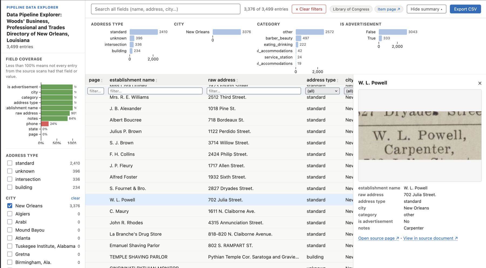
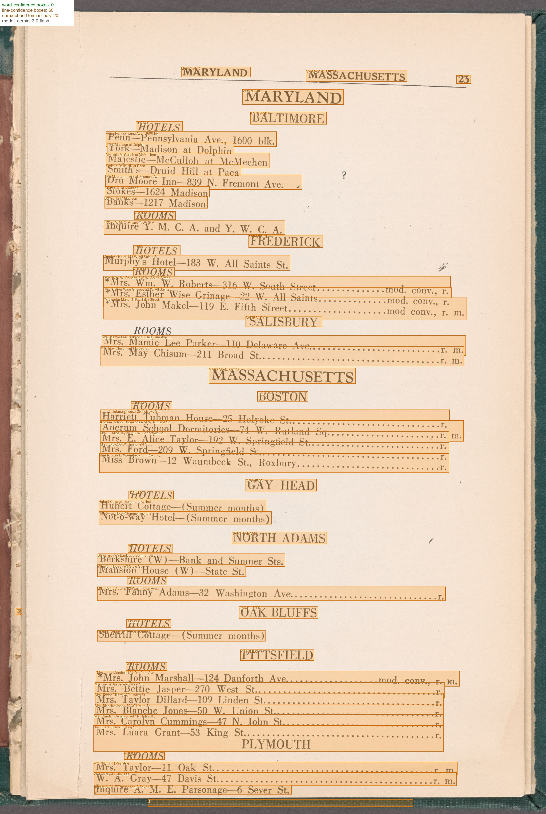

# directory-pipeline

Turn a public digital archive URL into a structured, browsable CSV — no manual transcription, no custom code per collection type.

Give it a URL from the [Library of Congress](https://www.loc.gov/collections/), [Internet Archive](https://archive.org/), [NYPL Digital Collections](https://digitalcollections.nypl.org/), or any institution that publishes a public IIIF manifest. It downloads the scans, OCRs them, and extracts entries into a structured CSV. With the enrichment steps, every row links back to the exact location in the original scan.

Built for digitized historical directories — city directories, gazetteers, trade directories — but works on just about any historical document with regularl entry-like structure.



*The auto-generated data explorer. Categorical facets generated from the data, full-text search, IIIF page thumbnails, and a "View in source document" deep link for every row.*

---

## Quick start

```bash
# One-time calibration steps for a new collection type — generates OCR and NER prompts that will work for any item with the same entry structure
python main.py https://archive.org/details/ldpd_11290437_000/ --download
python main.py https://archive.org/details/ldpd_11290437_000/ --select-pages
python main.py https://archive.org/details/ldpd_11290437_000/ --generate-prompts

# "--extract" Automated shortcut — produces entries CSV + browsable HTML explorer for any subsequent volumes in the same series
python main.py https://archive.org/details/ldpd_11290437_000/ --extract
```

**Calibrate once, run many.** The first three commands are a one-time step per collection type: `--select-pages` opens a browser UI where you pick 4–10 representative pages; `--generate-prompts` has Gemini analyze them and write tailored OCR and extraction prompts. For any additional volume in the same series, point to the relevant NER prompt, and skip calibration entirely:

```bash
python main.py https://archive.org/details/ldpd_11290437_001/ --extract \
  --ner-prompt output/ldpd_11290437_000/ner_prompt.md
```

Requires `GEMINI_API_KEY`. Can run on the [free tier](#costs) — no billing required for collections up to ~150 pages.

---

## What you get

A CSV where every row is one extracted entry. Field names are driven entirely by your NER prompt — no code changes necessary for a new document or volume of the same type:

| name | address | city | state | category | canvas_fragment |
|---|---|---|---|---|---|
| Mrs. Simmons Tourist Home | 418 Johnson St | Augusta | GA | Tourist Home | `https://...#xywh=142,890,1240,68` |

The `canvas_fragment` column is a IIIF URI pointing back to the source scan. With the [precision upgrade](#precision-upgrade), it includes a `#xywh=` bounding box pinpointing the exact line. The data explorer and map use this to link directly to the highlighted entry in the original document.

Alongside the extracted data CSV, `--extract` also generates a self-contained HTML data explorer (shown above). With `--geocode --map` run on materials with address fields, you also get:


*Markers clustered and color-coded by category. Popups include a IIIF thumbnail fetched directly from the source institution's image server.*

---

## Installation

Requires Python 3.11+ and [uv](https://docs.astral.sh/uv/).

```bash
uv sync                  # core: Gemini OCR + entry extraction
uv sync --extra gpu      # add Surya OCR (GPU or Apple Silicon recommended)
uv sync --extra geo      # add geocoding + map generation
uv sync --all-extras     # everything
```

Set your API keys (or copy `.env.template` to `.env`):

```bash
export GEMINI_API_KEY=your_key_here
export NYPL_API_TOKEN=your_token_here      # only needed for NYPL API access
export GOOGLE_MAPS_API_KEY=your_key_here   # optional; enables address-level geocoding
```

---

## Going further

| Goal | Flags / command |
|---|---|
| Add spatial bounding boxes to every row | `--surya-ocr --align-ocr` [→ details](#precision-upgrade) |
| Interactively fix unmatched lines | `--review-alignment` |
| Geocode entries and build a map | `--geocode --map` |
| Full pipeline with page scoping + alignment review | `--guided` |
| Export W3C/IIIF annotations | `pipeline/iiif/export_annotations.py` |

### Precision upgrade

The core path (`--download --gemini-ocr --extract-entries`) gives you a canvas URI per row. Adding `--surya-ocr --align-ocr` upgrades every `canvas_fragment` to a `#xywh=` bounding box — the exact line on the page, usable by any IIIF viewer:

```bash
python main.py URL --surya-ocr --align-ocr
python main.py URL --review-alignment     # optional: fix unmatched lines interactively
```



---

## Costs

A single 100-page volume costs roughly **$0.60 in Gemini API charges** with a paid account but can run within the free tier's daily quota (~15–20 minutes at 15 RPM). See [docs/costs.md](docs/costs.md) for a full breakdown including platform costs (Surya OCR on Mac, Colab, and GPU).

---

## Docs

- [Pipeline stage reference](docs/pipeline-stages.md) — every flag, script, and output file
- [Usage examples](docs/usage-examples.md) — full examples by source (LoC, IA, NYPL, IIIF manifest)
- [Costs](docs/costs.md) — API and platform cost breakdown
- [Key design decisions](docs/key-design-decisions.md) — architecture and technical notes
- [Prior work](docs/prior-work.md) — related research and citations


## Key design decisions

- **Gemini for accuracy, Surya for coordinates.** Gemini transcribes historical print far more accurately than conventional OCR; Surya provides line-level bounding boxes that anchor coordinates.
- **Anchored Needleman-Wunsch alignment.** City/state headings that appear verbatim in both sources are committed as fixed anchors before the NW pass, preventing misalignment drift on long pages.
- **Schema-agnostic NER.** `extract_entries.py` hard-codes nothing. The NER prompt defines all field names; CSV columns are inferred dynamically — no code changes for a new collection type.
- **IIIF-native output.** Every aligned line and entry carries a `canvas_fragment` (`#xywh=`) URI in natural image pixel coordinates, directly consumable by IIIF viewers and annotation tools.
- **Any IIIF source.** `--iiif-csv` and `--download` accept any public IIIF Presentation v2 or v3 manifest URL, not just NYPL/LoC/IA. IIIF Collection manifests are enumerated automatically, writing one CSV row per child manifest.

See [docs/key-design-decisions.md](docs/key-design-decisions.md) for full technical notes.

---

## Prior work and inspirations

- **Greif et al. (2025)** — foundational benchmark showing multimodal LLMs beat Tesseract + Transkribus on historical city directories (0.84% CER with Gemini 2.0 Flash). Directly motivates the two-stage OCR + NER architecture. ([arXiv:2504.00414](https://arxiv.org/abs/2504.00414))
- **Bell et al. — *directoreadr* (2020)** — closest prior work; end-to-end pipeline for Polk city directories using classical CV + Tesseract. Documents the brittle year-specific heuristics this pipeline replaces. ([PLOS ONE](https://doi.org/10.1371/journal.pone.0220219))
- **Fleischhacker et al. (2025)** — layout detection as preprocessing improves OCR accuracy by 15+ pp on multi-column historical docs. Motivates column reading-order correction in `align_ocr.py`. ([Int. J. Digital Libraries](https://doi.org/10.1007/s00799-025-00413-z))
- **Cook et al. (2020)** — canonical prior Green Books digitization (entirely manual; OCR rejected). Source of the six-category establishment taxonomy used here. ([NBER WP 26819](https://www.nber.org/papers/w26819))
- **Smith & Cordell (2018)** — practitioner research agenda naming layout analysis as the top barrier to historical OCR and validating NW-style sequence alignment for ground truth creation. ([NEH report](https://repository.library.northeastern.edu/files/neu:m043p093w))
- **Carlson et al. — *EffOCR* (2023)** — OCR benchmarks on historical newspapers (Tesseract ~10.6% CER, fine-tuned TrOCR 1.3%). Establishes the noisy-input baseline for the alignment stage. ([arXiv:2304.02737](https://arxiv.org/abs/2304.02737))
- **Wolf et al. (2020)** — machine-readable NYC directory entries 1850–1890 from NYPL digitizations. Direct precedent for applying this pipeline to city directories. ([NYU Faculty Digital Archive](https://archive.nyu.edu/handle/2451/61521))

See [docs/prior-work.md](docs/prior-work.md) for full annotated citations.
